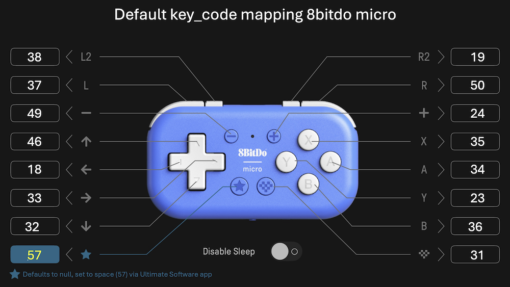

# 8BitDo Micro Gamepad Remote Control Blueprint for Home Assistant

[](https://my.home-assistant.io/redirect/blueprint_import/?blueprint_url=https%3A//raw.githubusercontent.com/arnoudkooi/HomeAssistantShare/main/blueprints/8bitdomicro/8bitdomicro.yaml)



## Quick Start

**One-Click Import**: Import this blueprint into your Home Assistant instance (update the import URL as needed).

## Features

- ✅ **Complete Button Support**: All main buttons and D-pad directions
- ✅ **Individual Actions**: Each button can trigger any Home Assistant action independently
- ✅ **Simple Configuration**: Straightforward setup
- ✅ **Skip Unused Buttons**: Leave any button action blank to ignore it
- ✅ **Single Mode**: Prevents overlapping executions for reliable operation

## Requirements

### Prerequisites
1. **Home Assistant** with blueprint support
2. **8BitDo Micro** gamepad connected via USB or Bluetooth
3. **keyboard_remote integration** installed and configured

### Bluetooth Keypad Setup (Optional)

⚠️ **Warning**: Bluetooth pairing can be tedious and may require multiple attempts and system restarts.

If you're using a Bluetooth 8BitDo Micro, you'll need to pair it manually via terminal:

#### Step-by-Step Bluetooth Pairing

1. **Access Home Assistant Terminal**:
   - SSH into your Home Assistant system
   - Or use the Terminal add-on if available

2. **Start Bluetooth Service**:
   ```bash
   bluetoothctl
   ```

3. **Enable Discovery**:
   ```bash
   power on
   agent on
   default-agent
   scan on
   ```

4. **Put Your Gamepad in Pairing Mode**:
   - Follow your 8BitDo Micro's manual (usually hold a pairing button)
   - Look for your device in the scan results

5. **Pair the Device**:
   ```bash
   pair XX:XX:XX:XX:XX:XX
   trust XX:XX:XX:XX:XX:XX
   connect XX:XX:XX:XX:XX:XX
   ```
   Replace `XX:XX:XX:XX:XX:XX` with your gamepad's MAC address

6. **Exit Bluetooth Control**:
   ```bash
   exit
   ```

7. **Restart Home Assistant**:
   - This is often required for the device to be properly recognized
   - Go to **Settings** → **System** → **Restart**

> **Note:** In some cases, it may work better to execute the bluetoothctl commands directly, such as:
> ```bash
> bluetoothctl pair XX:XX:XX:XX:XX:XX
> ```
> This can sometimes be more reliable than entering bluetoothctl mode

#### Bluetooth Troubleshooting

- **Device not found**: Ensure gamepad is in pairing mode and close to Home Assistant
- **Pairing fails**: Try removing device (`remove XX:XX:XX:XX:XX:XX`) and re-pairing
- **Keys not working**: Restart Home Assistant after successful pairing
- **Connection drops**: Some gamepads have power-saving modes that disconnect

📺 **Detailed Video Guide**: For a fun and informative guide about the keyboard_remote integration that inspired me check Paul Hibbert's video, see: [https://www.youtube.com/watch?v=YV0DFPBQbWQ&t](https://www.youtube.com/watch?v=YV0DFPBQbWQ&t)

> **Note:** Long-term use of the 8BitDo Micro with Home Assistant has not been fully tested. You may experience issues where the device is not found after a Home Assistant reboot. If this occurs, you may need to re-pair or reconnect the device.

## Key Mappings (8BitDo Micro)

| Button         | trigger.id      | Key Code | Label in UI/Image |
| -------------- | --------------- | -------- | ------------------ |
| L2             | L2              | 38       | L2                |
| L              | L               | 37       | L                 |
| Minus          | MINUS           | 49       | -                 |
| ← (D-pad left) | DPAD_LEFT       | 18       | ⬅️                |
| ↑ (D-pad up)   | DPAD_UP         | 46       | ⬆️                |
| → (D-pad right)| DPAD_RIGHT      | 39       | ➡️                |
| ↓ (D-pad down) | DPAD_DOWN       | 32       | ⬇️                |
| Right bottom   | RIGHT_BOTTOM    | 31       | ▦                |
| Star (Sleep)   | STAR            | 57       | ⭐                |
| R2             | R2              | 19       | R2                |
| R              | R               | 50       | R                 |
| +              | PLUS            | 24       | +                 |
| X              | X               | 35       | X                 |
| A              | A               | 36       | A                 |
| Y              | Y               | 23       | Y                 |
| B              | B               | 34       | B                 |
| Logo           | LOGO            | 31       | Logo              |

> **Note:** The ⭐ is default to null, I have remapped this to the space bar (key code 57) in the Ultimate Software app on a mobile device.

---

### Example: Mapping Any Button to a Remote Key Event (Portrait Orientation)

You can use the `any_key_action` to send a remote key event based on which button was pressed, with the device rotated 90 degrees (portrait orientation). Here is a complete mapping for each key:

```yaml
any_key_action:
  - service: remote.send_command
    target:
      entity_id: remote.living_room
    data:
      command: >
         RIGHT
         DOWN
         LEFT
         UP
         OK
         BACK
         MENU
         INFO
         VOLUME_DOWN
         VOLUME_UP
         CHANNEL_DOWN
         CHANNEL_UP
         PLAY_PAUSE
         MUTE
         STAR
         HOME
         POWER
         UNKNOWN
        
```

This mapping assumes the D-pad is rotated for portrait use. Adjust the logical remote key names as needed for your setup.
(not tested )

## Example Configurations for specic keys

### Smart Home Control
```yaml
# A - Toggle living room lights
action:
  - choose:
      - conditions:
          - condition: trigger
            id: A
        sequence:
          - service: light.toggle
            target:
              entity_id: light.living_room
```

### Scene Control
```yaml
# Y - Home scene
action:
  - choose:
      - conditions:
          - condition: trigger
            id: Y
        sequence:
          - service: scene.turn_on
            target:
              entity_id: scene.home
```

### Media Control
```yaml
# R - Volume up
action:
  - choose:
      - conditions:
          - condition: trigger
            id: R
        sequence:
          - service: media_player.volume_up
            target:
              entity_id: media_player.living_room_speaker
```

---

For setup, pairing, and troubleshooting, see the instructions above, but substitute "8BitDo Micro" for "numeric keypad."
