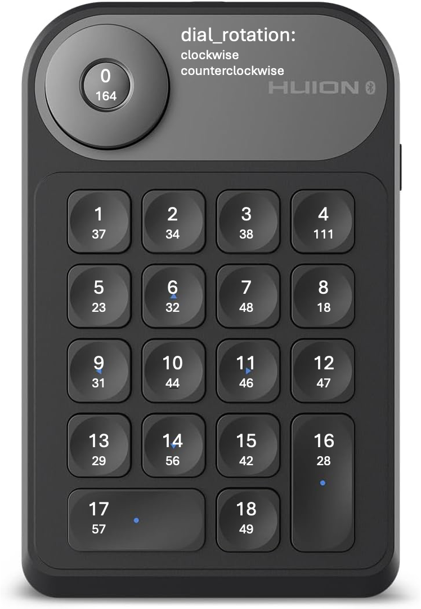

# Huion Keydial Mini K20 Blueprint

A Home Assistant blueprint for controlling your Huion Keydial Mini K20 device with 18 keys and 1 rotary dial.

[](https://my.home-assistant.io/redirect/blueprint_import/?blueprint_url=https://raw.githubusercontent.com/arnoudkooi/HomeAssistantShare/main/blueprints/huion/keydial-mini-k20.yaml)



## Features

- **1 Rotary Dial** with clockwise, counter-clockwise rotation and **Key 0** in the center
- **18 Keys** arranged in a compact grid layout
- **Individual actions** for each control (21 total inputs)
- **Global action** for handling any key press or dial action
- **Easy setup** with device descriptor configuration

## Layout

```
         [DIAL with KEY_0]
[KEY_1] [KEY_2] [KEY_3] [KEY_4]
[KEY_5] [KEY_6] [KEY_7] [KEY_8]
[KEY_9] [KEY_10] [KEY_11] [KEY_12]
[KEY_13] [KEY_14] [KEY_15] [KEY_16]
        [KEY_17] [KEY_18]
```

## Setup

1. Import the blueprint into Home Assistant
2. Create a new automation using this blueprint
3. Set your device descriptor paths:
   - **Keys device descriptor**: `/dev/input/event...` (for keys)
   - **Dial device descriptor**: `/dev/input/event10` (for dial rotation)
4. Configure actions for each key/dial you want to use
5. Save and test your automation

> **Note**: This device uses two separate input devices - one for the keys and one for the dial rotation events.

## Usage

The `{{ trigger.id }}` variable will contain the logical name of the pressed button or dial action:
- Keys: `KEY_0` (dial center), `KEY_1`, `KEY_2`, ..., `KEY_18`
- Dial: `DIAL_CW`, `DIAL_CCW`

## Key Mappings

Based on the device layout, the key codes are:
- **Key 0** (dial center): 164
- **Key 1**: 37 | **Key 2**: 34 | **Key 3**: 38 | **Key 4**: 111
- **Key 5**: 23 | **Key 6**: 32 | **Key 7**: 48 | **Key 8**: 18
- **Key 9**: 31 | **Key 10**: 44 | **Key 11**: 46 | **Key 12**: 47
- **Key 13**: 29 | **Key 14**: 56 | **Key 15**: 42 | **Key 16**: 28
- **Key 17**: 57 | **Key 18**: 49
- **Dial Rotation**: dial_rotation events

## Requirements

- Home Assistant with keyboard_remote integration
- Physical Huion Keydial Mini K20 device
- Two device descriptors (keys and dial use separate input devices)

### Device Detection

To find your device paths, check the keyboard_remote integration logs or use:
```bash
ls -la /dev/input/event*
```
The dial typically appears as `/dev/input/event10` while keys use a different event number.

### Bluetooth Connection

If using Bluetooth, this device requires manual pairing. For detailed Bluetooth setup instructions, see the [Numeric Keypad Blueprint](../numeric-keyboard/README.md#bluetooth-keypad-setup-optional) which includes step-by-step terminal pairing instructions. 