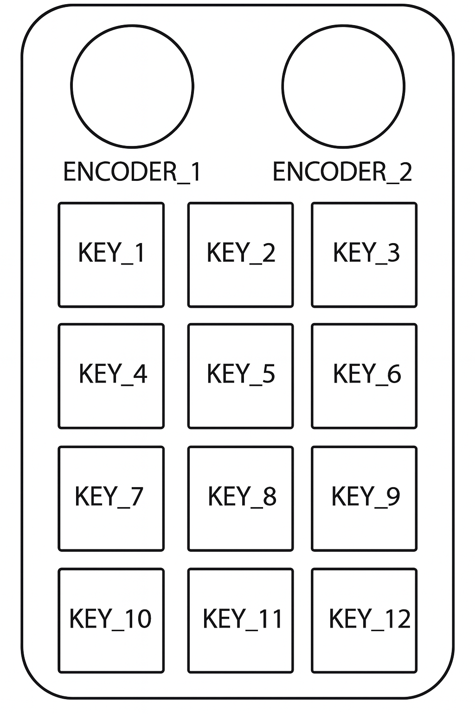

# Macropad 12-Key 2-Knob Blueprint

A Home Assistant blueprint for controlling your 12-key 2-knob macropad device.

[](https://my.home-assistant.io/redirect/blueprint_import/?blueprint_url=https://raw.githubusercontent.com/arnoudkooi/HomeAssistantShare/main/blueprints/macropad12key2knob/macropad12key2knob.yaml)



## Features

- **2 Rotary Encoders** with clockwise, counter-clockwise, and click functions
- **12 Keys** arranged in a 4×3 grid
- **Individual actions** for each control (18 total inputs)
- **Global action** for handling any key press
- **Easy setup** with device descriptor configuration

## Layout

```
[ENCODER_1] [ENCODER_2]
[KEY_1] [KEY_2] [KEY_3] [KEY_4]
[KEY_5] [KEY_6] [KEY_7] [KEY_8]
[KEY_9] [KEY_10] [KEY_11] [KEY_12]
```

## Setup

1. Import the blueprint into Home Assistant
2. Create a new automation using this blueprint
3. Set your device descriptor path (`/dev/input/event...`)
4. Configure actions for each key/encoder you want to use
5. Save and test your automation

## Usage

The `{{ trigger.id }}` variable will contain the logical name of the pressed button or encoder action:
- Keys: `KEY_1`, `KEY_2`, ..., `KEY_12`
- Encoders: `ENCODER_1_CW`, `ENCODER_1_CCW`, `ENCODER_1_CLICK`, `ENCODER_2_CW`, `ENCODER_2_CCW`, `ENCODER_2_CLICK`

## Example

See `example_tv_remote_automation.yaml` for a complete TV remote control setup.

## Requirements

- Home Assistant with keyboard_remote integration
- Physical macropad device connected via USB 