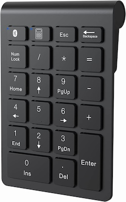

# Numeric Keypad Remote Control Blueprint for Home Assistant

A simple and reliable Home Assistant blueprint that enables full control of numeric keypad devices (calculators, USB keypads, etc.) with individual actions for each key.

[](https://my.home-assistant.io/redirect/blueprint_import/?blueprint_url=https%3A//raw.githubusercontent.com/arnoudkooi/HomeAssistantShare/main/blueprints/numeric-keyboard/keypad.yaml)



## Quick Start

**One-Click Import**: Click the button above to automatically import this blueprint into your Home Assistant instance.

## Features

- ✅ **Complete Key Support**: All 17 keys including numbers, operators, and special functions
- ✅ **Individual Actions**: Each key can trigger any Home Assistant action independently
- ✅ **Simple Configuration**: Straightforward setup with no complex sequences
- ✅ **Skip Unused Keys**: Leave any key action blank to ignore it
- ✅ **Single Mode**: Prevents overlapping executions for reliable operation

## Requirements

### Prerequisites
1. **Home Assistant** with blueprint support
2. **Numeric Keypad/Calculator** device properly connected via USB or Bluetooth
3. **keyboard_remote integration** installed and configured

### Bluetooth Keypad Setup (Optional)

⚠️ **Warning**: Bluetooth pairing can be tedious and may require multiple attempts and system restarts.

If you're using a Bluetooth numeric keypad, you'll need to pair it manually via terminal:

#### Step-by-Step Bluetooth Pairing

1. **Access Home Assistant Terminal**:
   - SSH into your Home Assistant system
   - Or use the Terminal add-on if available

2. **Start Bluetooth Service**:
   ```bash
   bluetoothctl
   ```

3. **Enable Discovery**:
   ```bash
   power on
   agent on
   default-agent
   scan on
   ```

4. **Put Your Keypad in Pairing Mode**:
   - Follow your keypad's manual (usually hold a pairing button)
   - Look for your device in the scan results

5. **Pair the Device**:
   ```bash
   pair XX:XX:XX:XX:XX:XX
   trust XX:XX:XX:XX:XX:XX
   connect XX:XX:XX:XX:XX:XX
   ```
   Replace `XX:XX:XX:XX:XX:XX` with your keypad's MAC address

6. **Exit Bluetooth Control**:
   ```bash
   exit
   ```

7. **Restart Home Assistant**:
   - This is often required for the device to be properly recognized
   - Go to **Settings** → **System** → **Restart**

#### Bluetooth Troubleshooting

- **Device not found**: Ensure keypad is in pairing mode and close to Home Assistant
- **Pairing fails**: Try removing device (`remove XX:XX:XX:XX:XX:XX`) and re-pairing
- **Keys not working**: Restart Home Assistant after successful pairing
- **Connection drops**: Some keypads have power-saving modes that disconnect

📺 **Detailed Video Guide**: For a fun and informative guide about the keyboard_remote integration that inspired me check Paul Hibbert's video, see: [https://www.youtube.com/watch?v=YV0DFPBQbWQ&t](https://www.youtube.com/watch?v=YV0DFPBQbWQ&t)

## Installation

### Method 1: Import via URL
1. In Home Assistant, go to **Settings** → **Automations & Scenes** → **Blueprints**
2. Click **"IMPORT BLUEPRINT"**
3. Enter the raw GitHub URL of the blueprint file
4. Click **"PREVIEW BLUEPRINT"** and then **"IMPORT BLUEPRINT"**

### Method 2: Manual Installation
1. Download the `keypad.yaml` file
2. Place it in your `config/blueprints/automation/` directory
3. Restart Home Assistant or reload automations

## Configuration

### Device Setup
1. Connect your numeric keypad via USB
2. Find your device path (usually `/dev/input/eventX`)
3. You can find this by checking Home Assistant logs or using the keyboard_remote integration

### Creating an Automation
1. Go to **Settings** → **Automations & Scenes** → **Automations**
2. Click **"+ CREATE AUTOMATION"**
3. Select **"Use a blueprint"**
4. Choose **"Shortcut Remote – Actions per Key"**
5. Configure the required fields:
   - **Device descriptor**: Your device path (e.g., `/dev/input/event5`)
   - **Individual key actions**: Configure actions for the keys you want to use

## Key Mappings

| Key | Code | Function | Description |
|-----|------|----------|-------------|
| **Calculator** | `140` | Special function | Calculator/Mode key |
| **Escape** | `1` | ESC | Escape/Cancel key |
| **Backspace** | `14` | ⌫ | Backspace/Delete key |
| **/** | `98` | Division | Division operator |
| * | `55` | Multiplication | Multiplication operator |
| **-** | `74` | Subtraction | Minus/Subtraction operator |
| **+** | `78` | Addition | Plus/Addition operator |
| **=** | `117` | Equals | Equals/Result key |
| **Enter** | `96` | ⏎ | Enter/Confirm key |
| **0** | `82` | Zero | Number zero |
| **1** | `79` | One | Number one |
| **2** | `80` | Two | Number two |
| **3** | `81` | Three | Number three |
| **4** | `75` | Four | Number four |
| **5** | `76` | Five | Number five |
| **6** | `77` | Six | Number six |
| **7** | `71` | Seven | Number seven |
| **8** | `72` | Eight | Number eight |
| **9** | `73` | Nine | Number nine |

## Example Configurations

### Smart Home Control
```yaml
# 1 - Toggle living room lights
one_action:
  - service: light.toggle
    target:
      entity_id: light.living_room

# 2 - Toggle bedroom lights
two_action:
  - service: light.toggle
    target:
      entity_id: light.bedroom

# 0 - Turn off all lights
zero_action:
  - service: light.turn_off
    target:
      entity_id: all
```

### Scene Control
```yaml
# Calculator key - Home scene
calculator_action:
  - service: scene.turn_on
    target:
      entity_id: scene.home

# Enter - Good night scene
enter_action:
  - service: scene.turn_on
    target:
      entity_id: scene.good_night
```

### Media Control
```yaml
# + Volume up
plus_action:
  - service: media_player.volume_up
    target:
      entity_id: media_player.living_room_speaker

# - Volume down
minus_action:
  - service: media_player.volume_down
    target:
      entity_id: media_player.living_room_speaker

# Enter - Play/Pause
enter_action:
  - service: media_player.media_play_pause
    target:
      entity_id: media_player.living_room_speaker
```

### Climate Control
```yaml
# + Increase temperature
plus_action:
  - service: climate.set_temperature
    target:
      entity_id: climate.living_room
    data:
      temperature: "{{ state_attr('climate.living_room', 'temperature') + 1 }}"

# - Decrease temperature
minus_action:
  - service: climate.set_temperature
    target:
      entity_id: climate.living_room
    data:
      temperature: "{{ state_attr('climate.living_room', 'temperature') - 1 }}"
```

### Notification System
```yaml
# Numbers 1-9 for different notification types
one_action:
  - service: notify.mobile_app_your_phone
    data:
      message: "Security alert triggered"

two_action:
  - service: notify.mobile_app_your_phone
    data:
      message: "Doorbell pressed"

three_action:
  - service: notify.mobile_app_your_phone
    data:
      message: "Package delivered"
```

## Advanced Examples

### Multi-Service Actions
```yaml
# Calculator key - "I'm home" routine
calculator_action:
  - service: scene.turn_on
    target:
      entity_id: scene.welcome_home
  - service: climate.set_temperature
    target:
      entity_id: climate.living_room
    data:
      temperature: 22
  - service: notify.mobile_app_your_phone
    data:
      message: "Welcome home! House is ready."
```

### Conditional Actions
```yaml
# 0 - Smart "Off" button (context-aware)
zero_action:
  - choose:
      # If TV is on, turn it off
      - conditions:
          - condition: state
            entity_id: media_player.tv
            state: "on"
        sequence:
          - service: media_player.turn_off
            target:
              entity_id: media_player.tv
      # If lights are on, turn them off
      - conditions:
          - condition: state
            entity_id: light.living_room
            state: "on"
        sequence:
          - service: light.turn_off
            target:
              entity_id: all
    # Default: turn off everything
    default:
      - service: scene.turn_on
        target:
          entity_id: scene.all_off
```

## Troubleshooting

### Common Issues

**Keys not responding:**
- Verify the device descriptor path is correct
- Check that the keyboard_remote integration is working
- Ensure your keypad is properly connected via USB

**Wrong key codes:**
- Key codes may vary between different keypad models
- Check Home Assistant logs to see actual key codes being sent
- Update the blueprint or automation with correct codes

**Multiple keypads:**
- Each keypad needs its own automation instance
- Use different device descriptor paths for each device

### Finding Your Device Path
1. Connect your keypad
2. Check Home Assistant logs for keyboard_remote events
3. Look for `/dev/input/eventX` in the logs
4. Use this path in your automation configuration

### Debug Mode
Enable debug logging for detailed information:

```yaml
logger:
  logs:
    homeassistant.components.automation: debug
    custom_components.keyboard_remote: debug
```

## Technical Details

### How It Works
1. **Event Listening**: Each key press generates a `keyboard_remote_command_received` event
2. **Individual Triggers**: Separate trigger for each key with specific key_code
3. **Action Dispatch**: Uses choose/condition logic to execute the right action
4. **Single Mode**: Prevents overlapping executions

### Supported Devices
- USB numeric keypads
- Calculator-style keypads  
- Wireless numeric keypads (if they appear as keyboard devices)
- Any device that sends standard keyboard events

## Customization

### Adding New Keys
If your keypad has additional keys, you can extend the blueprint by:
1. Adding new input definitions
2. Adding corresponding triggers with the correct key_code
3. Adding the action to the choose block

### Key Code Discovery
To find key codes for unlisted keys:
1. Enable debug logging
2. Press the key on your device
3. Check logs for the key_code value
4. Add to your automation configuration

## Contributing

Feel free to contribute improvements, bug fixes, or support for additional keypad models:

1. Fork the repository
2. Create a feature branch
3. Make your changes
4. Submit a pull request

## License

This blueprint is provided as-is under the MIT License. Feel free to modify and distribute according to your needs.

## Support

If you encounter issues:
1. Check the troubleshooting section above
2. Review Home Assistant logs for keyboard_remote events
3. Verify your device is sending the expected key codes
4. Open an issue on GitHub with detailed information about your setup

---

**Perfect for Home Assistant users who want simple, reliable keypad control** 🔢✨