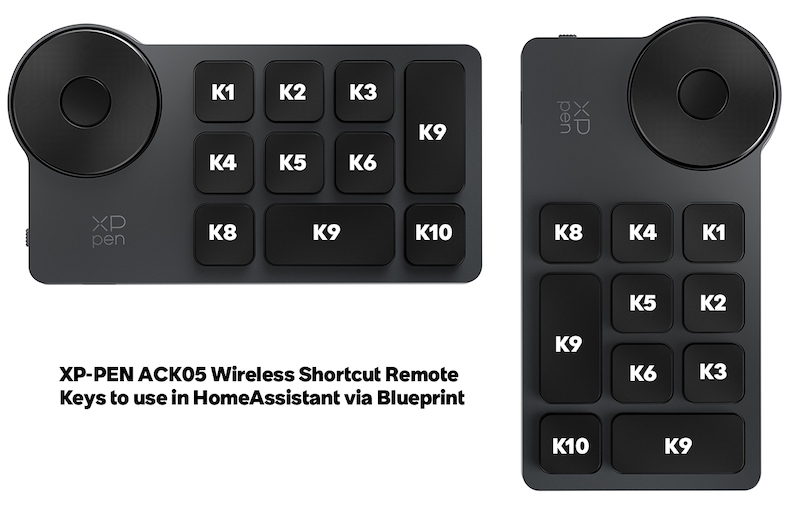
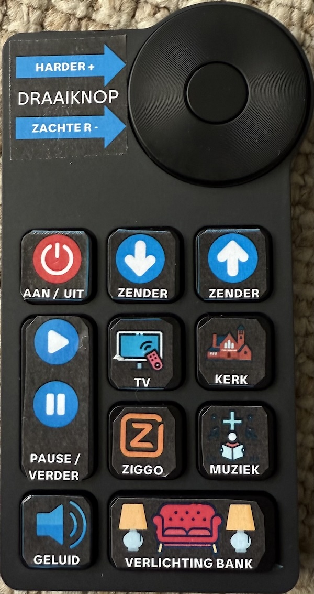

# XP-Pen ACK05 Remote Control Blueprint for Home Assistant

A modern Home Assistant blueprint that enables full control of XP-Pen ACK05 remote devices with support for both simple key presses and complex multi-key sequences.

[](https://my.home-assistant.io/redirect/blueprint_import/?blueprint_url=https%3A//raw.githubusercontent.com/arnoudkooi/HomeAssistantShare/main/blueprints/xp-pen/xp-pen-ack05.yaml)



## End Result

This setup transforms the XP-Pen ACK05 into a simplified TV remote with printed labels (14mm square) making it perfect for elderly users or anyone who wants a clean, easy-to-use interface. Each button can trigger any Home Assistant automation - from simple light controls to complex workflows that integrate with n8n to lookup suitable TV programs based on preferences.



## Quick Start

**One-Click Import**: Click the button above to automatically import this blueprint into your Home Assistant instance.

## Features

- ✅ **Complete Key Support**: All 10 keys plus rotary knob (CW/CCW)
- ✅ **Multi-Key Sequences**: Handles complex key combinations reliably
- ✅ **Debounced Events**: Prevents double triggers with intelligent state management
- ✅ **Flexible Actions**: Each key can trigger any Home Assistant action
- ✅ **Orientation Support**: Works in both landscape and portrait modes

## Requirements

### Prerequisites
1. **Home Assistant** with blueprint support
2. **XP-Pen ACK05 Remote** properly connected via USB or Bluetooth
3. **keyboard_remote integration** installed and configured
4. **Input Text Helper** entity for state management

📺 **Detailed Video Guide**: For a comprehensive walkthrough of the keyboard_remote integration in Home Assistant, see: [https://www.youtube.com/watch?v=YV0DFPBQbWQ&t](https://www.youtube.com/watch?v=YV0DFPBQbWQ&t)

### Bluetooth XP-Pen Setup (Optional)

⚠️ **Warning**: Bluetooth pairing can be tedious and may require multiple attempts and system restarts.

If you're using a Bluetooth XP-Pen ACK05, you'll need to pair it manually via terminal:

#### Step-by-Step Bluetooth Pairing

1. **Access Home Assistant Terminal**:
   - SSH into your Home Assistant system
   - Or use the Terminal add-on if available

2. **Start Bluetooth Service**:
   ```bash
  bluetoothctl
   ```

3. **Enable Discovery**:
   ```bash
   power on
   agent on
   default-agent
   scan on
   ```

4. **Put Your XP-Pen in Pairing Mode**:
   - Follow your XP-Pen manual (usually hold the pairing button)
   - Look for your device in the scan results

5. **Pair the Device**:
   ```bash
   pair XX:XX:XX:XX:XX:XX
   trust XX:XX:XX:XX:XX:XX
   connect XX:XX:XX:XX:XX:XX
   ```
   Replace `XX:XX:XX:XX:XX:XX` with your XP-Pen's MAC address

6. **Exit Bluetooth Control**:
   ```bash
   exit
   ```

7. **Restart Home Assistant**:
   - This is often required for the device to be properly recognized
   - Go to **Settings** → **System** → **Restart**

#### Bluetooth Troubleshooting

- **Device not found**: Ensure XP-Pen is in pairing mode and close to Home Assistant
- **Pairing fails**: Try removing device (`remove XX:XX:XX:XX:XX:XX`) and re-pairing
- **Keys not working**: Restart Home Assistant after successful pairing
- **Connection drops**: XP-Pen devices may have power-saving modes that disconnect

### Setup Input Text Helper

Before using this blueprint, create an input text helper:

1. Go to **Settings** → **Devices & Services** → **Helpers**
2. Click **"+ CREATE HELPER"**
3. Select **"Text"**
4. Configure:
   - **Name**: `XP-Pen Remote State`
   - **Entity ID**: `input_text.xp_pen_remote_state`
   - **Max length**: `255`
5. Click **"CREATE"**

## Installation

### Method 1: Import via URL
1. In Home Assistant, go to **Settings** → **Automations & Scenes** → **Blueprints**
2. Click **"IMPORT BLUEPRINT"**
3. Enter the raw GitHub URL of the blueprint file
4. Click **"PREVIEW BLUEPRINT"** and then **"IMPORT BLUEPRINT"**

### Method 2: Manual Installation
1. Download the `xp-pen-ack05.yaml` file
2. Place it in your `config/blueprints/automation/` directory
3. Restart Home Assistant or reload automations

## Configuration

### Device Setup
1. Find your XP-Pen device path (usually `/dev/input/eventX`)
2. You can find this by checking Home Assistant logs or using the keyboard_remote integration

### Creating an Automation
1. Go to **Settings** → **Automations & Scenes** → **Automations**
2. Click **"+ CREATE AUTOMATION"**
3. Select **"Use a blueprint"**
4. Choose **"XP-Pen Remote – Complex Key Sequences"**
5. Configure the required fields:
   - **Device descriptor**: Your device path (e.g., `/dev/input/event4`)
   - **XP-Pen Remote State**: Select `input_text.xp_pen_remote_state`

## Key Mappings

### Landscape Orientation (Default)

| Key | Code(s) | Portrait Equivalent | Description |
|-----|---------|-------------------|-------------|
| **K1** | `29→24` | First row, third key | Top row, first key |
| **K2** | `29→49` | Second row, third key | Top row, second key |
| **K3** | `63` | Third row, third key | Top row, third key |
| **K4** | `42` | First row, second key | Middle row, first key |
| **K5** | `29` | Second row, second key | Middle row, second key |
| **K6** | `56` | Third row, second key | Middle row, third key |
| **K7** | `29→31` | First row, first key (double) | Top row, fourth key (double height) |
| **K8** | `29→44` | First row, fourth key | Bottom row, first key |
| **K9** | `57` | Second row, first key (double) | Bottom row, second key (double width) |
| **K10** | `29→42→44` | Third row, first key | Bottom row, third key |

### Rotary Knob
- **Clockwise**: `29→74`
- **Counter-clockwise**: `29→78`

## Example Configurations

### Basic Light Control
```yaml
# K1 - Toggle living room lights
K1_action:
  - service: light.toggle
    target:
      entity_id: light.living_room

# K2 - Dim lights
K2_action:
  - service: light.turn_on
    target:
      entity_id: light.living_room
    data:
      brightness_pct: 20
```

### Volume Control with Rotary Knob
```yaml
# Clockwise - Volume up
rotate_cw_action:
  - service: media_player.volume_up
    target:
      entity_id: media_player.living_room_speaker

# Counter-clockwise - Volume down
rotate_ccw_action:
  - service: media_player.volume_down
    target:
      entity_id: media_player.living_room_speaker
```

### Scene Control
```yaml
# K3 - Movie time scene
K3_action:
  - service: scene.turn_on
    target:
      entity_id: scene.movie_time

# K4 - Good night scene
K4_action:
  - service: scene.turn_on
    target:
      entity_id: scene.good_night
```

## Troubleshooting

### Common Issues

**Keys not responding:**
- Verify the device descriptor path is correct
- Check that the keyboard_remote integration is working
- Ensure the input_text helper is created and accessible

**Double triggers:**
- Make sure you've created the input_text helper
- Verify the helper entity ID matches the blueprint configuration

**Multi-key sequences not working:**
- Check Home Assistant logs for any timing issues
- Ensure the device is sending the expected key codes

### Debug Mode
Enable debug logging for more detailed information:

```yaml
logger:
  logs:
    homeassistant.components.automation: debug
```

## Technical Details

### How It Works
1. **Event Capture**: Listens for `keyboard_remote_command_received` events
2. **Sequence Building**: Builds key sequences with timing-based detection
3. **State Management**: Uses input_text helper to prevent double triggers
4. **Action Execution**: Matches sequences to configured actions with 80ms debouncing

### Timing Parameters
- **Sequence timeout**: 100ms (keys must arrive within this window)
- **Debounce delay**: 80ms (prevents duplicate executions)
- **Execution window**: 150ms (maximum time for sequence completion)

## Contributing

Feel free to contribute improvements, bug fixes, or additional features:

1. Fork the repository
2. Create a feature branch
3. Make your changes
4. Submit a pull request

## License

This blueprint is provided as-is under the MIT License. Feel free to modify and distribute according to your needs.

## Support

If you encounter issues:
1. Check the troubleshooting section above
2. Review Home Assistant logs
3. Open an issue on GitHub with detailed information about your setup

---

**Made for Home Assistant users who want reliable XP-Pen ACK05 integration** 🏠✨ 